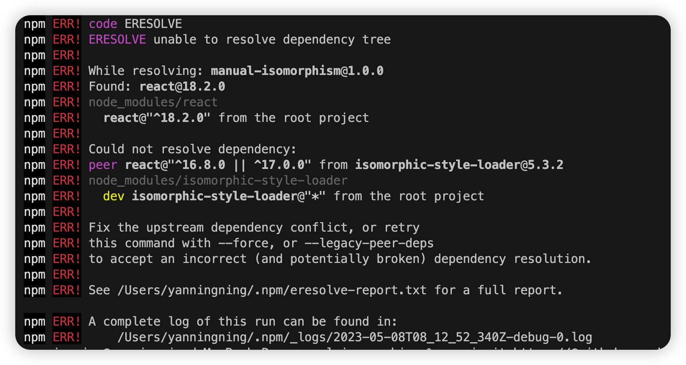

```bash
mkdir manual-isomorphism
cd manual-isomorphism
npm init -y
npm i webpack webpack-cli @babel/core @babel/preset-env @babel/preset-react -D
mkdir server
npx tsc --init
npm i typescript ts-loader -D
npm install webpack-node-externals --save-dev
```

开启 jsx 的编译；

ts:
添加 lib,
开启 jsx



https://github.com/kriasoft/isomorphic-style-loader/pull/206/commits

npm i git+https://@github.com:kriasoft/isomorphic-style-loader.git#4c21d77da1faca3348a1f83701d5f64cb3c3b7a9 -D

[模块加载](https://www.freecodecamp.org/chinese/news/webpack-module-loading/)

npm link 测试代码会造成项目存在两个 React 的情况；

react-router-6 的权限认证；
